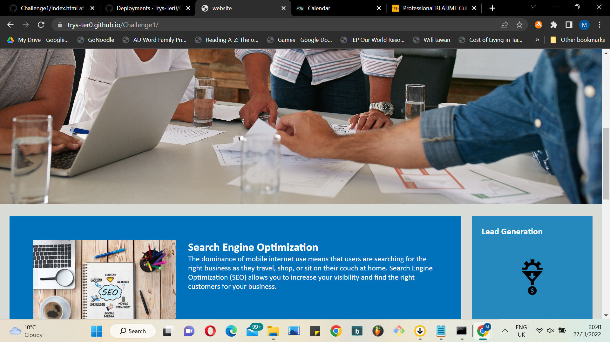
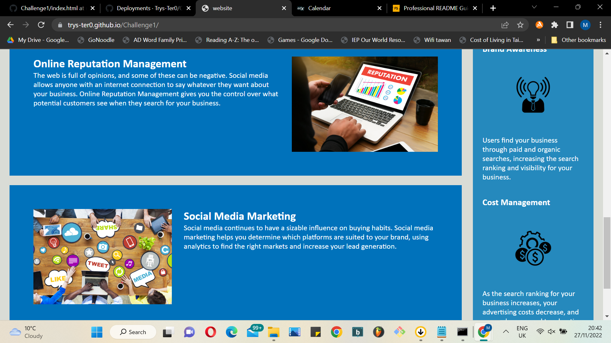
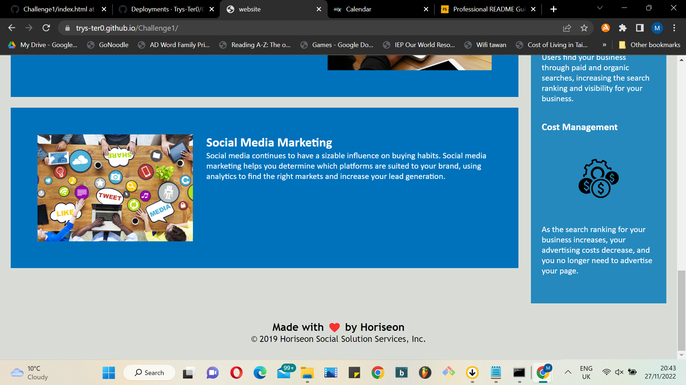

# Horiseon: HTML CSS Code Refactor

## Project Description
Horiseon tasked me with refactoring the CSS and improving accessibility of their website. This meant auditing and optimising the HTML for semantic tags, and consolidating selectors and properties in CSS. I also reordered the CSS to follow the semantic structure of the HTML. Changes are commented in the code. I learnt a lot about how a web page is coded determines its visibilty to search engines. Content may be king, but you could say that content's visibility depends on semantic discipline.
 
## Installation

Access the site on a browser: https://trys-ter0.github.io/Challenge1/

## Usage

Once the site is loaded, you can navigate using the links in the navbar.

## Credits

Horiseon supplied the codebase and images.

## Licence

MIT
